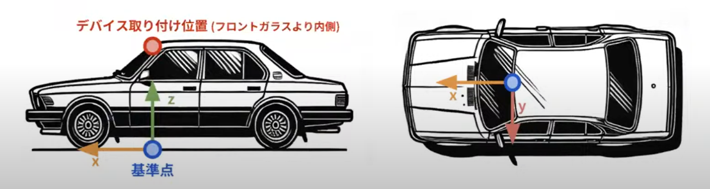

## データセットの説明
画像サイズ：幅 128pixel, 高さ 64 pixel

| 変数名 | データ型 | 説明 | 備考 |
|--------|----------|------|------|
| ID | str | シーンIDとフレーム番号を組み合わせた識別子 <br>ID は `{シーンID}_{シーンのデシ秒数}`で構成| `0a7d64c1e7fda174fc26c7cedd49d782_320` はシーン ID `0a7d64c1e7fda174fc26c7cedd49d782` の `32` 秒経過時の走行情報|
| vEgo | float | 車の速度 | 単位: m/s |
| aEgo | float | 車の加速度 | 単位: m/s^2 |
| steeringAngleDeg | float | ハンドル角度 | 単位: 度、反時計回りが正 |
| steeringTorque | float | ハンドルのトルク | 単位: N・m、反時計回りが正 |
| brake | float | ブレーキペダルの踏み込み度合い | 0~1の値で最大踏み込みで1 |
| brakePressed | bool | ブレーキペダルの踏み込み状態 | 踏まれているかどうかの真偽値 |
| gas | float | アクセルペダルの踏み込み度合い | 0~1の値で最大踏み込みで1 |
| gasPressed | bool | アクセルペダルの踏み込み状態 | 踏まれているかどうかの真偽値 |
| gearShifter | {'drive', 'park', 'reverse', 'neutral'} | シフトノブの状態 | - |
| leftBlinker | bool | 左ウィンカーの状態 | 点灯しているかどうかの真偽値 |
| rightBlinker | bool | 右ウィンカーの状態 | 点灯しているかどうかの真偽値 |



## 座標系について
座標系は以下の3種類があります：

1. 自車中心座標系
- 原点: 自車の中心位置
- X軸: 自車の進行方向を正とする
- Y軸: 自車の左側方向を正とする
- Z軸: 上向きを正とする右手系

2. カメラ座標系
- 原点: カメラの光学中心
- X軸: カメラの右方向を正とする
- Y軸: カメラの下方向を正とする
- Z軸: カメラの光軸方向(前方)を正とする

3. 画像座標系
- 原点: 画像の左上
- u軸: 右方向を正とする(ピクセル単位)
- v軸: 下方向を正とする(ピクセル単位)

カメラ座標系から画像座標系への変換は、上記の内部パラメータ行列(intrinsic matrix)を用いて行われます。
カメラは地上高1.22mに設置されており、自車中心座標系からカメラ座標系への変換はこの設置位置を考慮して行われます。

## 予測対象の点列 (train にのみ付与されます)
x_0 ~ z_6 までの 6x3 列が予測対象です。
t + 0.5 秒 , t + 1 秒 , t + 1.5 秒 , t + 2 秒 , t + 2.5 秒 , t + 3 秒 における
自車の位置を時刻 t における自車中心座標系で表現した(x, y, z)の座標を表しています。


## カメラの内部パラメータ


[[226.16438356, 0., 63.62426614],
 [0., 224.82352941, 11.76],
 [0., 0., 1.]]

 デバイス取り付け位置は地平面から高さ 1.22m のところに取り付けています


## traffic_lights: 信号機の情報
あるシーンの画像から検出された信号機の情報が json 形式で含まれています。

 - index: 検出結果の番号
 - class: 検出された信号機の種類
   - green: 青色信号
   - yellow: 黄色信号
   - red: 赤色信号
   - straight: 矢印信号機の直進
   - left: 矢印信号機の左折
   - right: 矢印信号機の右折
   - empty: 点滅が観測できない信号機
   - other: それ以外の信号機
 - bbox:
   - 検出された領域の bounding box 座標. 順に [左上の x 座標 / 左上の y 座標 / 右下の x 座標 / 右下の y 座標 ] です.

### 例
```
[
  {
    "index": 1,
    "class": "green",
    "bbox": [
      52.10526657104492, 0.4521563649177551, 54.89796829223633,
      2.365220308303833
    ]
  },
  {
    "index": 2,
    "class": "green",
    "bbox": [
      26.555194854736328, 1.5511059761047363, 29.644622802734375,
      3.4975063800811768
    ]
  }
]```